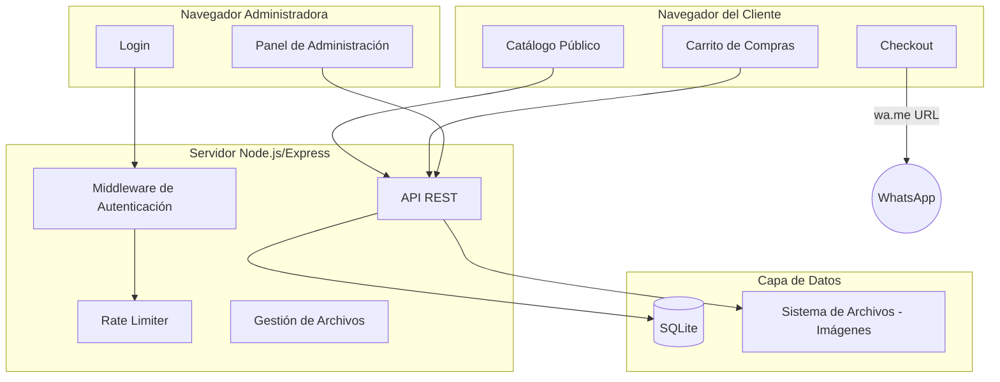
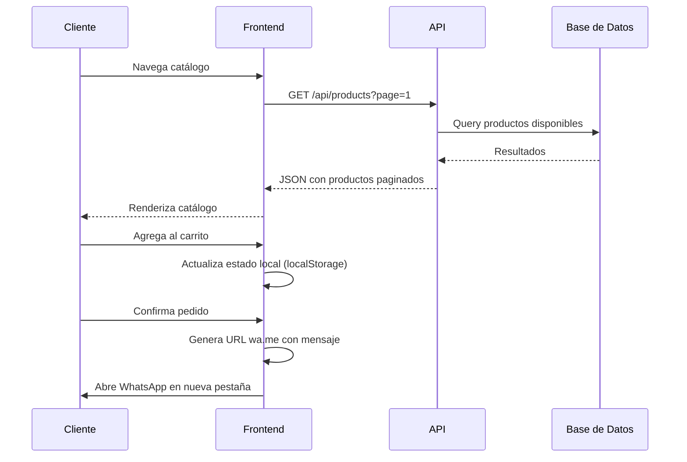
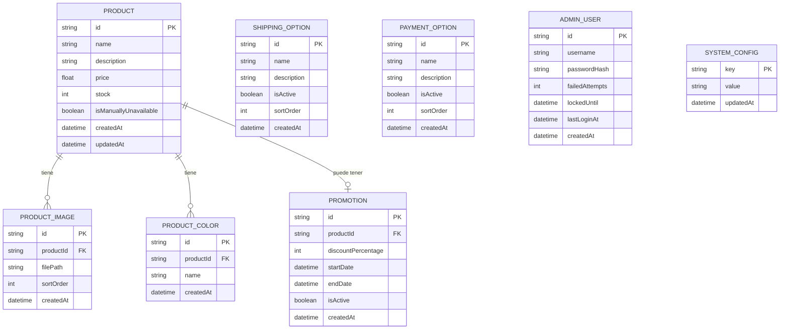
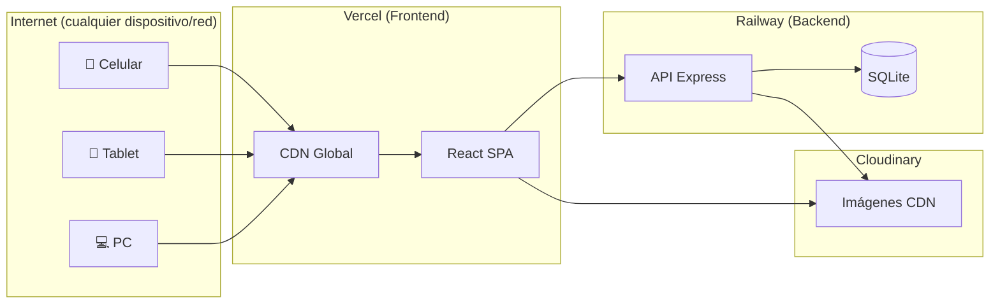

# Documento de Diseño - Catálogo Digital SOLCITO REGALERIA

## Overview

El sistema es una aplicación web de catálogo digital para la regalería "SOLCITO REGALERIA". Permite a la administradora gestionar productos a través de un panel de administración protegido, y a los clientes navegar el catálogo público, armar un carrito de compras y enviar pedidos vía WhatsApp.

### Decisiones Tecnológicas

| Aspecto | Tecnología | Justificación |
|---------|-----------|---------------|
| Frontend | React + TypeScript | Componentes reutilizables, tipado estático, ecosistema maduro |
| Estilos | Tailwind CSS | Desarrollo rápido, responsive por defecto |
| Backend | Node.js + Express + TypeScript | Mismo lenguaje que frontend, buen rendimiento para I/O |
| Base de Datos | SQLite (vía Prisma ORM) | Sin necesidad de servidor separado, ideal para un solo usuario admin |
| Almacenamiento de imágenes | Sistema de archivos local + servido estático | Simplicidad para una tienda pequeña |
| Autenticación | JWT + bcrypt | Stateless, seguro, estándar de la industria |
| Bundler | Vite | Rápido en desarrollo y producción |
| Hosting Frontend | Vercel | CDN global, deploy automático, HTTPS gratis, tier gratuito generoso |
| Hosting Backend | Railway | Deploy de Node.js + SQLite persistente, tier gratuito, HTTPS automático |
| Almacenamiento de imágenes | Cloudinary (tier gratuito) | CDN global para imágenes, transformaciones automáticas, 25GB gratis |
| Diseño responsive | Tailwind CSS (mobile-first) | Se adapta a celular, tablet y PC automáticamente |

---

## Architecture

### Diagrama de Arquitectura General



### Patrón de Arquitectura

Se utiliza una arquitectura **cliente-servidor** con:

- **Frontend SPA** (Single Page Application) servida como archivos estáticos
- **API REST** como capa de comunicación
- **Separación clara** entre rutas públicas (catálogo) y rutas protegidas (admin)

### Flujo de Datos Principal



---

## Components and Interfaces

### Frontend - Componentes Principales

#### Módulo Catálogo Público

| Componente | Responsabilidad |
|-----------|----------------|
| `ProductGrid` | Grilla de productos con paginación (20/página) |
| `ProductCard` | Tarjeta individual con imagen, nombre, precio |
| `ProductDetail` | Vista detallada con galería, colores, descripción |
| `SearchBar` | Barra de búsqueda con filtrado en tiempo real |
| `Pagination` | Controles de paginación |
| `PriceDisplay` | Formateo de precios en ARS ($X.XXX,XX) |
| `PromotionBadge` | Indicador de precio promocional con tachado |

#### Módulo Carrito

| Componente | Responsabilidad |
|-----------|----------------|
| `CartProvider` | Context provider para estado global del carrito |
| `CartDrawer` | Panel lateral con resumen del carrito |
| `CartItem` | Línea de artículo con controles de cantidad |
| `CartSummary` | Total acumulado y botón de checkout |
| `ColorSelector` | Selector de color al agregar artículo |

#### Módulo Checkout

| Componente | Responsabilidad |
|-----------|----------------|
| `CheckoutPage` | Página de finalización del pedido |
| `ShippingOptions` | Lista de opciones de envío configuradas |
| `PaymentOptions` | Lista de opciones de pago configuradas |
| `OrderSummary` | Resumen final antes de enviar |
| `WhatsAppButton` | Genera y abre URL de WhatsApp |

#### Módulo Admin

| Componente | Responsabilidad |
|-----------|----------------|
| `LoginForm` | Formulario de autenticación |
| `AdminLayout` | Layout con navegación del panel admin |
| `ProductForm` | Formulario CRUD de artículos |
| `ImageUploader` | Carga múltiple de imágenes (máx. 10) |
| `ColorManager` | Gestión de colores por artículo |
| `PromotionForm` | Creación/edición de promociones |
| `StockManager` | Control de stock y disponibilidad |
| `ShippingConfig` | Configuración de opciones de envío |
| `PaymentConfig` | Configuración de opciones de pago |
| `WhatsAppConfig` | Configuración del número de WhatsApp |

### Backend - Módulos de API

#### Endpoints Públicos (sin autenticación)

| Método | Ruta | Descripción |
|--------|------|-------------|
| GET | `/api/products` | Lista productos disponibles (paginado) |
| GET | `/api/products/:id` | Detalle de un producto |
| GET | `/api/products/search?q=` | Búsqueda de productos |
| GET | `/api/shipping-options` | Opciones de envío activas |
| GET | `/api/payment-options` | Opciones de pago activas |
| GET | `/api/config/whatsapp` | Número de WhatsApp configurado |

#### Endpoints Protegidos (requieren JWT)

| Método | Ruta | Descripción |
|--------|------|-------------|
| POST | `/api/auth/login` | Iniciar sesión |
| POST | `/api/auth/logout` | Cerrar sesión |
| GET | `/api/admin/products` | Lista todos los productos (incluye no disponibles) |
| POST | `/api/admin/products` | Crear producto |
| PUT | `/api/admin/products/:id` | Actualizar producto |
| DELETE | `/api/admin/products/:id` | Eliminar producto |
| POST | `/api/admin/products/:id/images` | Subir imágenes |
| DELETE | `/api/admin/products/:id/images/:imageId` | Eliminar imagen |
| POST | `/api/admin/products/:id/colors` | Agregar color |
| DELETE | `/api/admin/products/:id/colors/:colorId` | Eliminar color |
| POST | `/api/admin/products/:id/promotions` | Crear promoción |
| PUT | `/api/admin/promotions/:id` | Editar promoción |
| DELETE | `/api/admin/promotions/:id` | Cancelar/eliminar promoción |
| GET | `/api/admin/shipping-options` | Lista opciones de envío |
| POST | `/api/admin/shipping-options` | Crear opción de envío |
| PUT | `/api/admin/shipping-options/:id` | Editar opción de envío |
| DELETE | `/api/admin/shipping-options/:id` | Eliminar opción de envío |
| GET | `/api/admin/payment-options` | Lista opciones de pago |
| POST | `/api/admin/payment-options` | Crear opción de pago |
| PUT | `/api/admin/payment-options/:id` | Editar opción de pago |
| DELETE | `/api/admin/payment-options/:id` | Eliminar opción de pago |
| PUT | `/api/admin/config/whatsapp` | Configurar número WhatsApp |

### Interfaces TypeScript Clave

```typescript
// Respuesta paginada genérica
interface PaginatedResponse<T> {
  data: T[];
  pagination: {
    page: number;
    pageSize: number;
    totalItems: number;
    totalPages: number;
  };
}

// Producto público (catálogo)
interface ProductPublic {
  id: string;
  name: string;
  description: string;
  price: number;
  discountedPrice: number | null;
  images: ProductImage[];
  colors: ProductColor[];
  isAvailable: boolean;
  promotion: PromotionPublic | null;
}

// Artículo del carrito (almacenado en localStorage)
interface CartItem {
  productId: string;
  productName: string;
  color: string | null;
  quantity: number;
  unitPrice: number;
  imageUrl: string | null;
}

// Mensaje WhatsApp
interface WhatsAppOrder {
  items: CartItem[];
  shippingOption: { name: string; description: string };
  paymentOption: { name: string; description: string };
  total: number;
}
```

---

## Data Models

### Diagrama Entidad-Relación



### Esquema Prisma

```prisma
model Product {
  id                   String         @id @default(uuid())
  name                 String         @db.VarChar(100)
  description          String         @db.VarChar(500)
  price                Float
  stock                Int            @default(0)
  isManuallyUnavailable Boolean       @default(false)
  createdAt            DateTime       @default(now())
  updatedAt            DateTime       @updatedAt

  images     ProductImage[]
  colors     ProductColor[]
  promotions Promotion[]
}

model ProductImage {
  id        String   @id @default(uuid())
  productId String
  filePath  String
  sortOrder Int      @default(0)
  createdAt DateTime @default(now())

  product Product @relation(fields: [productId], references: [id], onDelete: Cascade)
}

model ProductColor {
  id        String   @id @default(uuid())
  productId String
  name      String   @db.VarChar(50)
  createdAt DateTime @default(now())

  product Product @relation(fields: [productId], references: [id], onDelete: Cascade)

  @@unique([productId, name])
}

model Promotion {
  id                 String   @id @default(uuid())
  productId          String
  discountPercentage Int
  startDate          DateTime
  endDate            DateTime
  isActive           Boolean  @default(true)
  createdAt          DateTime @default(now())

  product Product @relation(fields: [productId], references: [id], onDelete: Cascade)
}

model ShippingOption {
  id          String   @id @default(uuid())
  name        String   @db.VarChar(50)
  description String   @db.VarChar(200)
  isActive    Boolean  @default(true)
  sortOrder   Int      @default(0)
  createdAt   DateTime @default(now())
}

model PaymentOption {
  id          String   @id @default(uuid())
  name        String   @db.VarChar(50)
  description String   @db.VarChar(200)
  isActive    Boolean  @default(true)
  sortOrder   Int      @default(0)
  createdAt   DateTime @default(now())
}

model AdminUser {
  id             String    @id @default(uuid())
  username       String    @unique
  passwordHash   String
  failedAttempts Int       @default(0)
  lockedUntil    DateTime?
  lastLoginAt    DateTime?
  createdAt      DateTime  @default(now())
}

model SystemConfig {
  key       String   @id
  value     String
  updatedAt DateTime @updatedAt
}
```

### Reglas de Negocio en Datos

1. **Disponibilidad del producto**: Un producto es "disponible" cuando `stock > 0` AND `isManuallyUnavailable = false` AND `price > 0` AND tiene al menos una imagen.
2. **Promoción activa**: Una promoción está activa cuando `isActive = true` AND `startDate <= now()` AND `endDate > now()`.
3. **Precio con descuento**: `Math.round(price * (1 - discountPercentage / 100))`
4. **Bloqueo por intentos fallidos**: Se bloquea cuando `failedAttempts >= 5`, se establece `lockedUntil = now() + 15min`.
5. **Unicidad de color**: Constraint `@@unique([productId, name])` previene colores duplicados por producto.


---

## Correctness Properties

*Una propiedad es una característica o comportamiento que debe cumplirse en todas las ejecuciones válidas de un sistema — esencialmente, una declaración formal sobre lo que el sistema debe hacer. Las propiedades sirven como puente entre especificaciones legibles por humanos y garantías de correctitud verificables por máquina.*

### Property 1: Round-trip de creación de artículo

*Para cualquier* conjunto de datos válidos (nombre ≤100 chars, descripción ≤500 chars, precio entre 0.01 y 999999.99, al menos una imagen), crear un artículo y luego leerlo debe devolver los mismos datos que se enviaron.

**Validates: Requirements 1.1, 1.3**

### Property 2: Rechazo de artículo con datos inválidos

*Para cualquier* formulario de creación de artículo al que le falte al menos un campo obligatorio (nombre, descripción, precio, imagen), la operación de creación debe fallar y ningún artículo nuevo debe existir en la base de datos.

**Validates: Requirements 1.2**

### Property 3: Límite de imágenes por artículo

*Para cualquier* artículo, intentar agregar más de 10 imágenes debe ser rechazado, y el artículo nunca debe tener más de 10 imágenes asociadas.

**Validates: Requirements 1.5**

### Property 4: Unicidad y límite de colores

*Para cualquier* artículo y nombre de color, agregar un color ya existente en el artículo debe ser rechazado, y un artículo nunca debe tener más de 20 colores.

**Validates: Requirements 2.1, 2.2**

### Property 5: Requisito de color en el carrito

*Para cualquier* artículo con colores asignados, agregar al carrito sin seleccionar un color debe ser rechazado. *Para cualquier* artículo sin colores asignados, agregar al carrito sin seleccionar color debe ser aceptado.

**Validates: Requirements 2.5, 2.6**

### Property 6: Invariante de disponibilidad del producto

*Para cualquier* producto, su estado de disponibilidad en el catálogo público debe ser `true` si y solo si: stock > 0 AND no está marcado manualmente como no disponible AND tiene precio > 0 AND tiene al menos una imagen.

**Validates: Requirements 3.1, 3.3, 3.4, 3.5, 4.5**

### Property 7: Carrito impide agregar artículos no disponibles

*Para cualquier* artículo no disponible (stock = 0 O marcado manualmente como no disponible), intentar agregarlo al carrito debe ser rechazado.

**Validates: Requirements 3.6**

### Property 8: Validación de stock

*Para cualquier* valor de stock, el sistema debe aceptar enteros en el rango [0, 99999] y rechazar valores negativos, decimales o fuera de rango.

**Validates: Requirements 3.1, 3.2**

### Property 9: Formateo de precios en ARS

*Para cualquier* precio numérico positivo, la función de formateo debe producir una cadena que comience con "$" y use punto como separador de miles y coma como separador de decimales (patrón: `$X.XXX,XX`).

**Validates: Requirements 4.3**

### Property 10: Cálculo de precio con descuento

*Para cualquier* par (precio, porcentaje de descuento) donde precio > 0 y porcentaje está entre 1 y 99, el precio con descuento debe ser igual a `Math.round(precio * (1 - porcentaje / 100))`.

**Validates: Requirements 5.3**

### Property 11: Validación de promoción

*Para cualquier* intento de creación de promoción, el sistema debe aceptar únicamente cuando el porcentaje está en [1, 99] y la fecha de fin es posterior a la fecha de inicio, y rechazar en cualquier otro caso.

**Validates: Requirements 5.1, 5.2**

### Property 12: Unicidad de promoción activa por artículo

*Para cualquier* artículo que ya tiene una promoción activa, intentar crear una segunda promoción debe ser rechazado.

**Validates: Requirements 5.6**

### Property 13: Paginación y orden del catálogo

*Para cualquier* conjunto de productos disponibles, cada página del catálogo debe contener como máximo 20 artículos y los artículos deben estar ordenados alfabéticamente por nombre.

**Validates: Requirements 6.1**

### Property 14: Búsqueda parcial case-insensitive

*Para cualquier* término de búsqueda de al menos 2 caracteres y cualquier conjunto de productos, todos los resultados devueltos deben contener el término buscado (en minúsculas) dentro del nombre o descripción del producto (en minúsculas).

**Validates: Requirements 6.3**

### Property 15: Invariante del total del carrito

*Para cualquier* secuencia de operaciones en el carrito (agregar, modificar cantidad, eliminar), el total del carrito debe ser siempre igual a la suma de (cantidad × precio unitario) de todos los artículos presentes.

**Validates: Requirements 7.1, 7.2, 7.3**

### Property 16: Límite de stock en el carrito

*Para cualquier* intento de agregar cantidad > stock disponible, la cantidad en el carrito debe ajustarse al stock máximo disponible.

**Validates: Requirements 7.5**

### Property 17: Fusión de duplicados en el carrito

*Para cualquier* secuencia de adiciones del mismo artículo con el mismo color, el carrito debe tener una sola entrada cuya cantidad es la suma de las adiciones (limitada al stock), en lugar de crear entradas duplicadas.

**Validates: Requirements 7.6**

### Property 18: Completitud del mensaje de WhatsApp

*Para cualquier* pedido válido (carrito no vacío, envío seleccionado, pago seleccionado), el mensaje de WhatsApp generado debe contener: nombre de cada artículo, color, cantidad, precio unitario, subtotal, opción de envío, opción de pago y total general. La URL generada debe tener formato `https://wa.me/{número}?text={mensaje_codificado}`.

**Validates: Requirements 10.1, 10.2, 10.3**

### Property 19: Validación del número de WhatsApp

*Para cualquier* cadena de caracteres, la validación de número de WhatsApp debe aceptar únicamente cadenas compuestas por 10 a 15 dígitos y rechazar cualquier otra.

**Validates: Requirements 10.4**

### Property 20: Validación previa al envío del pedido

*Para cualquier* estado de checkout donde falta selección de envío, falta selección de pago, o el carrito está vacío, el sistema debe impedir la generación del mensaje de WhatsApp.

**Validates: Requirements 10.5**

### Property 21: Vaciado del carrito post-envío

*Para cualquier* pedido enviado exitosamente (mensaje de WhatsApp generado), el carrito debe quedar vacío inmediatamente después.

**Validates: Requirements 10.7**

### Property 22: Protección de rutas sin autenticación

*Para cualquier* solicitud a un endpoint protegido del panel admin sin un token JWT válido, el sistema debe responder con código 401 (no autorizado).

**Validates: Requirements 11.3**

### Property 23: Bloqueo por intentos fallidos

*Para cualquier* secuencia de 5 intentos fallidos consecutivos de login, el sistema debe bloquear el acceso por 15 minutos, rechazando incluso credenciales válidas durante ese período.

**Validates: Requirements 11.4**

### Property 24: Expiración de sesión por inactividad

*Para cualquier* token JWT con una antigüedad mayor a 30 minutos sin actividad, el sistema debe rechazar la solicitud y requerir re-autenticación.

**Validates: Requirements 11.6**

---

## Error Handling

### Estrategia General

| Capa | Estrategia | Ejemplo |
|------|-----------|---------|
| Validación de entrada (Frontend) | Validación en formularios con mensajes inmediatos | Campo nombre vacío → "El nombre es obligatorio" |
| Validación de entrada (Backend) | Middleware de validación con respuestas 400 | Precio negativo → `{ error: "El precio debe ser mayor a cero" }` |
| Autenticación | Respuestas genéricas sin filtración de info | Login fallido → "Credenciales inválidas" |
| Recursos no encontrados | Respuestas 404 con mensaje descriptivo | Producto eliminado → "El artículo no existe" |
| Conflictos de estado | Respuestas 409 con explicación | Color duplicado → "El color ya está asignado" |
| Errores del servidor | Respuestas 500 genéricas + logging interno | Error DB → "Error interno del servidor" |

### Códigos HTTP Utilizados

| Código | Uso |
|--------|-----|
| 200 | Operación exitosa |
| 201 | Recurso creado exitosamente |
| 400 | Error de validación en datos de entrada |
| 401 | No autenticado / token inválido o expirado |
| 403 | Sin permisos (cuenta bloqueada) |
| 404 | Recurso no encontrado |
| 409 | Conflicto (duplicado, promoción existente) |
| 413 | Imagen demasiado grande |
| 422 | Entidad no procesable (regla de negocio) |
| 429 | Rate limit alcanzado (brute force) |
| 500 | Error interno del servidor |

### Manejo de Errores del Carrito (Frontend)

El carrito funciona en localStorage del navegador. Errores posibles:

1. **Artículo ya no disponible**: Al verificar stock antes del checkout, si un artículo dejó de estar disponible, se notifica al cliente y se remueve del carrito.
2. **localStorage lleno**: Mostrar mensaje indicando que se limpie espacio o se use otro navegador.
3. **Datos corruptos**: Si el JSON del carrito no es parseable, se reinicia el carrito vacío.

### Manejo de Errores de Subida de Imágenes

- Formato no soportado → Rechazar con mensaje "Solo se permiten imágenes JPG, PNG o WebP"
- Tamaño excesivo (> 5MB) → Rechazar con mensaje "La imagen excede el tamaño máximo de 5MB"
- Límite de 10 imágenes → Rechazar con mensaje "Se alcanzó el máximo de 10 imágenes"

---

## Testing Strategy

### Enfoque Dual: Tests Unitarios + Tests Basados en Propiedades

Este proyecto se beneficia significativamente de property-based testing (PBT) porque tiene abundante lógica pura de negocio: cálculos de precios, validaciones de entrada, formateo de moneda, gestión de carrito, generación de mensajes, y reglas de disponibilidad.

### Librería de Property-Based Testing

- **fast-check** (para TypeScript/JavaScript)
- Mínimo 100 iteraciones por test de propiedad
- Cada test referencia su propiedad del documento de diseño

### Cobertura por Tipo de Test

#### Tests Basados en Propiedades (PBT)

Cada propiedad definida arriba se implementa como un test con `fast-check`:

| Propiedad | Módulo bajo test | Generadores principales |
|-----------|-----------------|------------------------|
| P1: Round-trip artículo | ProductService | Arbitrarios de nombre, descripción, precio |
| P2: Rechazo inválido | ProductValidation | Combinaciones de campos nulos/inválidos |
| P3: Límite imágenes | ImageService | Listas de 1-15 imágenes |
| P4: Colores únicos | ColorService | Strings aleatorios de color |
| P5: Color en carrito | CartService | Productos con/sin colores |
| P6: Disponibilidad | AvailabilityLogic | Combinaciones de stock, marca, precio, imagen |
| P7: Carrito no-disponible | CartService | Productos no disponibles |
| P8: Validación stock | StockValidation | Enteros y decimales aleatorios |
| P9: Formateo ARS | PriceFormatter | Números positivos aleatorios |
| P10: Cálculo descuento | PromotionCalc | Pares (precio, porcentaje) |
| P11: Validación promoción | PromotionValidation | Porcentajes y fechas aleatorios |
| P12: Unicidad promoción | PromotionService | Artículos con promociones |
| P13: Paginación | ProductQuery | Listas de 0-100 productos |
| P14: Búsqueda | SearchService | Strings y productos aleatorios |
| P15: Total carrito | CartCalculator | Secuencias de operaciones |
| P16: Límite stock carrito | CartService | Pares (cantidad, stock) |
| P17: Fusión duplicados | CartService | Adiciones repetidas |
| P18: Mensaje WhatsApp | WhatsAppGenerator | Pedidos completos aleatorios |
| P19: Validación WhatsApp num | PhoneValidation | Strings de dígitos |
| P20: Pre-validación checkout | CheckoutValidation | Estados incompletos |
| P21: Vaciado post-envío | CartService + Checkout | Pedidos completos |
| P22: Protección rutas | AuthMiddleware | Requests sin/con token inválido |
| P23: Bloqueo login | AuthService | Secuencias de intentos |
| P24: Expiración sesión | TokenValidation | Tokens con diferentes timestamps |

#### Tests Unitarios (Ejemplos)

- Confirmación de eliminación de artículo (1.4)
- Visualización de colores en detalle (2.4)
- Artículo sin imagen muestra placeholder (6.4)
- Búsqueda sin resultados muestra mensaje (6.5)
- Selección de opción de envío/pago (8.1, 8.2, 9.1, 9.2)
- Login exitoso (11.1)
- Logout (11.5)

#### Tests de Integración

- Flujo completo: crear artículo → visible en catálogo → agregar al carrito → checkout → WhatsApp
- Flujo de promoción: crear → verificar precio en catálogo → expiración automática
- Flujo de autenticación: login → operaciones admin → timeout → rechazo

### Formato de Tags en Tests

Cada test de propiedad incluirá un comentario con el formato:

```typescript
// Feature: solcito-digital-catalog, Property 9: Formateo de precios en ARS
fc.assert(
  fc.property(fc.float({ min: 0.01, max: 999999.99 }), (price) => {
    const formatted = formatPrice(price);
    expect(formatted).toMatch(/^\$[\d.]+,\d{2}$/);
  }),
  { numRuns: 100 }
);
```

### Estructura de Directorios de Tests

```
src/
├── tests/
│   ├── properties/           # Tests basados en propiedades
│   │   ├── cart.property.test.ts
│   │   ├── pricing.property.test.ts
│   │   ├── availability.property.test.ts
│   │   ├── search.property.test.ts
│   │   ├── whatsapp.property.test.ts
│   │   ├── auth.property.test.ts
│   │   └── validation.property.test.ts
│   ├── unit/                 # Tests unitarios
│   │   ├── product.test.ts
│   │   ├── cart.test.ts
│   │   └── checkout.test.ts
│   └── integration/          # Tests de integración
│       ├── catalog-flow.test.ts
│       ├── admin-flow.test.ts
│       └── order-flow.test.ts
```

---

## Deployment Strategy

### Arquitectura de Despliegue en Internet



### Plataformas de Hosting

| Componente | Plataforma | Plan | Características |
|-----------|-----------|------|-----------------|
| Frontend | **Vercel** | Hobby (gratis) | HTTPS automático, CDN en 70+ ubicaciones, deploy con git push |
| Backend | **Railway** | Starter ($5/mes crédito gratis) | Node.js, volumen persistente para SQLite, HTTPS automático |
| Imágenes | **Cloudinary** | Free tier | 25GB almacenamiento, 25GB bandwidth/mes, transformaciones automáticas |
| Dominio | Opcional | Gratis con subdominios (.vercel.app, .up.railway.app) | Se puede agregar dominio custom después |

### Configuración de Despliegue

#### Frontend (Vercel)
- Conectar repositorio de GitHub
- Build command: `cd frontend && npm run build`
- Output directory: `frontend/dist`
- Variables de entorno: `VITE_API_URL=https://solcito-api.up.railway.app`

#### Backend (Railway)
- Conectar repositorio de GitHub
- Start command: `cd backend && npm run start`
- Variables de entorno: `DATABASE_URL`, `JWT_SECRET`, `CLOUDINARY_URL`, `CORS_ORIGIN`
- Volume persistente montado en `/data` para SQLite

#### Imágenes (Cloudinary)
- Reemplazar almacenamiento local por SDK de Cloudinary
- Upload directo desde el backend al crear/editar productos
- URLs de imágenes servidas desde CDN de Cloudinary
- Transformaciones automáticas (resize, optimización WebP)

### Responsive Design (Mobile-First)

La aplicación usa Tailwind CSS con breakpoints responsive:

| Breakpoint | Dispositivo | Diseño |
|-----------|------------|--------|
| `< 640px` (default) | Celular | 1 columna, menú hamburguesa, carrito fullscreen |
| `sm: 640px` | Celular grande | 2 columnas de productos |
| `md: 768px` | Tablet | 3 columnas, sidebar carrito |
| `lg: 1024px` | Laptop | 4 columnas, layout completo |
| `xl: 1280px` | Desktop | 5 columnas, panel admin expandido |

### Seguridad en Producción

- HTTPS obligatorio (provisto por Vercel y Railway automáticamente)
- CORS configurado solo para el dominio del frontend
- Variables sensibles (JWT_SECRET, CLOUDINARY_SECRET) en variables de entorno del hosting
- Rate limiting en endpoints de login
- Headers de seguridad (helmet.js)
